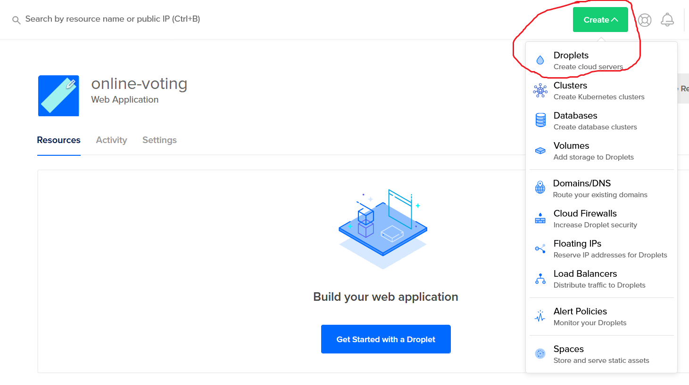
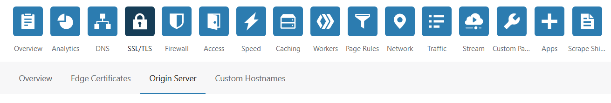
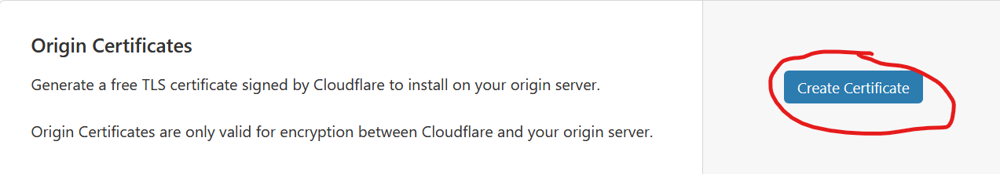

# Creating a Droplet

1. Log in to [DigitalOcean](https://cloud.digitalocean.com/login)
2. Create a droplet in the green dropdown from the toolbar at the top
  
3. Choose the Docker image from the Marketplace tab
4. Select the plan you need (for most instances, the $5 plan should be enough)
5. Follow the rest of the droplet creation instructions

# Assumptions

All instructions involving the droplet are assumed to have been done over SSH.

# Install SSL certificate

1. Log in to [Cloudflare](https://dash.cloudflare.com)
2. Select SSL/TLS > Origin Server

3. Create an Origin Certificate

4. Click Next
5. Save the contents of "Origin Certificate" in `<path to repository>/cloudflare.pem` inside the droplet
6. Save the contents of "Private key" in `<path to repository>/cloudflare.key` inside the droplet

# Creating database secrets

Create a folder name `secrets` inside the repository folder (of the droplet) and create 3 files:

* db_name.secret (name of database)
* db_user.secret (username for database owner)
* db_password.secret (password for database owner)

# Set the environment variables

Copy `.env.example` to `.env`.

```
SECRET_KEY=<string, encryption key for generating JWT tokens>

VALIDATE_USERS=<boolean, lets the system know if it should be checking if emails should be checked against>

START_TIME=<timestamp, start time of election (example: 2020-06-13T13:00-0400)>

END_TIME=<timestamp, end time of election (example: 2020-12-13T09:00-0500)>

PROD_URL=<string, url for front-end application (to prevent CORS issues)>

GOOGLE_CLIENT_ID=<string, same google client id that is being used in front-end application>

PGHOST=<'online-voting-db' or localhost (if not running Node server in Docker container)>

PGPORT=<5432>

PGUSER=<string, value set in /secrets/db_user.secret>

PGPASSWORD=<string, value set in /secrets/db_password.secret>

PGDATABASE=<string, value set in /secrets/db_name.secret>
```

NOTE: Make sure the timestamps are using the correct time offset (because of daylight savings)

## Setting up Sentry

1. Sign in to [Sentry](https://sentry.io/auth/login/)
2. Click "Projects" on the left-hand side
3. Click the "Create Project" button and follow the instructions
4. Save the Sentry DSN URL as `SENTRY_DSN` inside `.env`

# Creating the voting candidates list

Create a JSON file with the following structure:

```json
{
  "Chair": [
    { "name": "Ryan Reynolds" },
    { "name": "Chris Hemsworth" }
  ],
  "Vice-Chair": [
    ...
  ],
  ...
}
```

Save the JSON file in `<path to repository>/data/votingCandidates.json`

## Generating the voter list (optional)

Only needed if a certain amount of users are allowed to vote.

### Prerequisites

* Node.js 11+ (min version tested)
* npm/yarn

### Instructions

1. Clone the repository on your local machine
2. In your machine's terminal, run `npm install` or `yarn install` to install the dependencies needed
3. Run `node ./voterListGeneration.js <path to excel spreadsheet>` to generate the JSON of voters
4. Copy the `voters.json` file inside the data folder on your machine to the droplet in `<path to repository>/data/voters.json`

# Building

1. Install make on the droplet by running `apt install make`
2. Run `make build`

## Update and rebuild Docker image

Run `make update`.

# Running

## For first time

Run `make start`.

This will run all database migrations and initialize the database with data such as voting candidates and (if needed) the emails of the users to validate against.

## After setting up

Run `make start-quick`.
